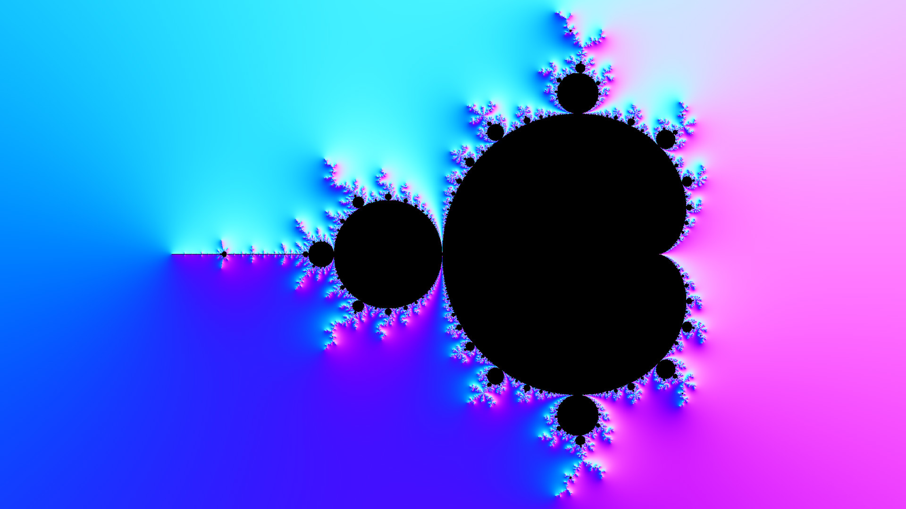

# Debugging the Toolchain

In this tutorial you will learn how to get detailed information about the calculation process while creating images or videos. 

## Generating Verbose Output

The standard way to get more information about the currently performed computation is to run DeepDrill, DeepMake, or DeepZoom with the `--verbose` (`-v`) command line option. With this flag specified, additional information about the current computation is provided to the user:
```none
./deepdrill -v top.ini -o top.map

DeepDrill 3.0 - (C)opyright Dirk W. Hoffmann

                        Center: -0.700000 + 0.000000i (128 bit)
                    Upper left: -2.791503 - 1.176471i (128 bit)
                   Lower right:  1.389325 + 1.174292i (128 bit)
                 Magnification: 0.85b1
                   Drill depth: 1000

                      Map size: 1920 x 1080 (3D)
                    Image size: 1920 x 1080 (2D)

                  Perturbation: yes
          Series approximation: yes
                 Area checking: yes
               Period checking: yes
            Attractor checking: yes

        Running the area check: ................................. 1.11 sec

Round 1 / 50: 1784039 points remaining

     Computing reference orbit: ................................. 0.00 sec

               Reference point: (960,540)
        Perturbation tolerance: 1e-06
                 Maximum depth: 1000
                  Actual depth: 1000

        Computing coefficients: ................................. 0.00 sec

                  Coefficients: 5
       Approximation tolerance: 1e-12

         Checking probe points: ................................. 0.00 sec

          Skippable iterations: 0

        Computing delta orbits: ................................. 1.21 sec

                      Glitches: 0

All rounds completed: 0 unresolved

            Preparing map file: ................................. 0.05 sec

                      Map size: 1920 x 1080
                 Drill results: Saved
              Iteration counts: Saved
           Skipped interations: Saved
                      Lognorms: Saved
                   Derivatives: Not saved
                       Normals: Saved

          Compressing map file: ................................. 0.64 sec

                Size reduction: 23062778 Bytes (65%)

               Saving map file: ................................. 0.00 sec
           Analyzing drill map: ................................. 0.00 sec

           Drill locations: 

                         Total:   2073600 (100.00 %)
                   Unprocessed:         0 (  0.00 %)
                      Interior:    318425 ( 15.36 %)
                      Exterior:   1755175 ( 84.64 %)
                      Glitches:         0 (  0.00 %)

           Locations with applied optimizations: 

                         Total:    308758 ( 14.89 %)
              Main bulb filter:    248206 ( 11.97 %)
               Cartioid filter:     41354 (  1.99 %)
          Series approximation:         0 (  0.00 %)
              Period detection:      1250 (  0.60 %)
           Attractor detection:     17948 (  0.87 %)

           Iteration counts: 

                         Total: 329839527 (100.00 %)
                      Interior: 318425000 ( 96.54 %)
                      Exterior:  11414527 (  3.46 %)

           Skipped iterations: 

                         Total: 301036579 ( 91.27 %)
              Main bulb filter: 248206000 ( 75.25 %)
               Cartioid filter:  41354000 ( 12.54 %)
          Series approximation:         0 (  0.00 %)
              Period detection:     91412 (  0.30 %)
           Attractor detection:  11385167 (  3.45 %)

Total time: 3.09 sec
```

## Highlighting pixels

To enable additional debug options, pass in profile `debug.ini`. This file contains the following definitions:
```INI
[perturbation]
color = red

[areacheck]
color = green

[attractorcheck]
color = blue

[periodcheck]
color = yellow
```
The `color` key in the `perturbation` section tells DeepDrill to draw all glitch points in red. Glitch points are points for which it is still unclear whether they belong to the Mandelbrot set or not. By default, these points are colored black. See the Theory section to learn more about perturbation theory and glitch point detection. 

The next three keys instruct DeepDrill to mark pixels for which the area checker, the attractor checker or the period checker has signaled a hit. All three checkers are used to speed up calculation. They are able to classify certain pixels as belonging to the Mandelbrot set before the maximum iteration count is reached. 


## Exporting the normal maps

The creation of spatial images as well as the calculation of texture overlays requires the calculation of a normal map. Normally, DeepDrill calculates this map internally and does not share it with the user. However, the map can be exported by adding the `normalmap.ini` profile to the command line options. The profile tells DeepDrill to run a special GPU filter that converts the normal map vectors into to RGB values:
```INI
[image]
depth = 1
illuminator = normalmap.glsl
```
Running DeepDrill with this profile results in the following image: 
```bash
./deepdrill -v -o normalmap.jpg normalmap.ini top.ini
```


The created image shows the typical bluish appearance of normal maps. The colors result from the way the normal vectors are encoded into the color channels of the image. 
