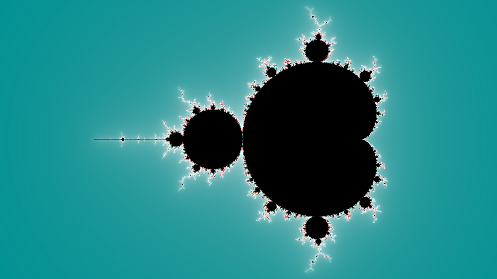
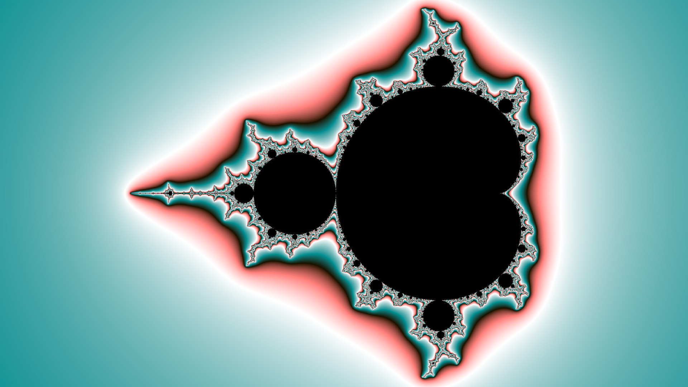

# Customizing the Color Palette

By default, DeepDrill colorizes the computed images with a default color palette. A custom color palette can be used by assigning a path to a palette image to the `palette.image` key. Here is an example: 
```none
./deepdrill top.ini -o image.map -o image.jpg palette.image=dolomiti.png
```



DeepDrill does not rely on a special palette format. Instead, the color palettes is specified in the form of a standard image file. For simplicity, there are no restrictions on the image format. DeepDrill composes the color palette from the pixels of the first horizontal line and ignores all others. The horizontal resolution of the palette does not affect the overall appearance of the image. However, wider images result in slightly smoother color transitions.

In addition, DeepDrill provides two keys to manipulate the color palette. Key `palette.scale` controls how fast the palette repeats. The following examples shows the effect: 
```none
./deepdrill top.ini -o image.map -o image.jpg palette.image=dolomiti.png palette.scale=10.0 
```


Key `palette.offset` can be utilized to shift the color palette like so: 
```none
./deepdrill top.ini -o image.map -o image.jpg palette.image=dolomiti.png palette.scale=10.0 palette.offset=0.5
```


## Predefined palettes

In the example shown above we have used image file `vulcano.png` which is one of several predefined color palettes. The images below give an overview of the available choices. Since you can pass any image file, it is easy to colorize  images with self-made palettes:

*default*


*candy*


*dolomiti*


*elements*


*ice*


*lindor*


*pistachio*


*prism*


*ruby*


*ultrafrac*


*vulcano*


