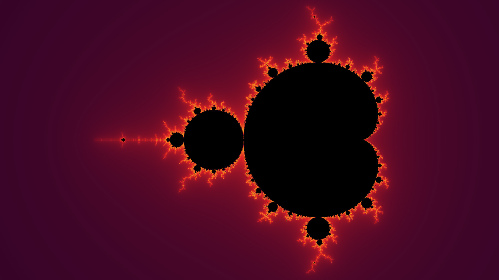
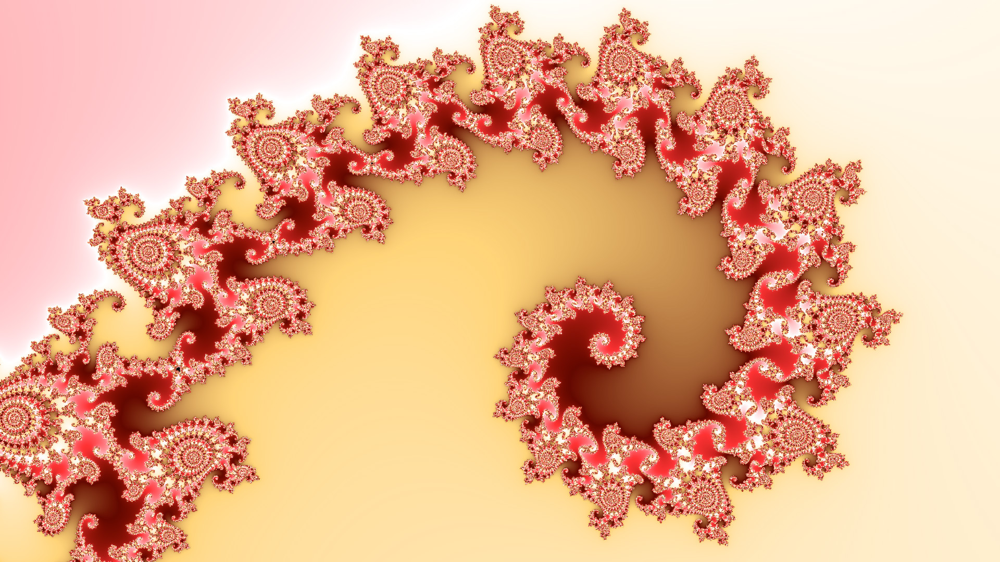
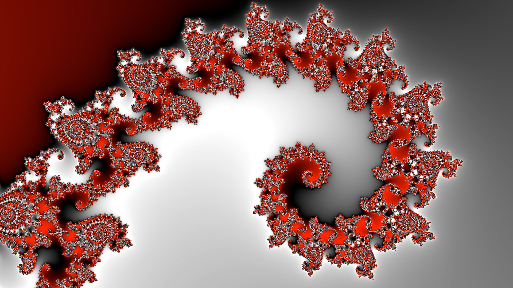
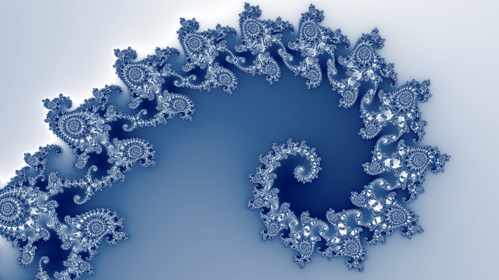

# Colorizing Images

In this tutorial you will learn how to colorize Mandelbrot images with different color palettes.

By default, images are created with a predefined color palette. The following call instructs DeepDrill to use a different palette.
```none
./deepdrill image.map -o image.jpg -c colors.palette=vulcano.png 
```


As shown above, the color palette is specified in the form of an image file. For simplicity, there are no restrictions on the format of the image. DeepDrill composes the color palette from the pixels of the first horizontal line and ignores all other lines. The horizontal resolution of the palette does not affect the overall appearance of the image. However, wider images result in slightly smoother color transitions.

In addition, DeepDrill provides a key called `colors.scale` which controls how fast the palette repeats. The following examples shows the effect: 

```none
./deepdrill image.map -c colors.palette=vulcano.png -c colors.scale=3.0 -o image.jpg 
```


## Predefined palettes

In the example shown above we have used palette image `vulcano.png` which is one of several predefined palettes. The images below give an overview of the available palettes. Since you can pass any image file as a palette image, you can easily colorize your images with a self-made palette:

*default*


*candy*


*dolomiti*


*elements*


*ice*


*lindor*


*pistachio*


*prism*


*ruby*


*ultrafrac*


*vulcano*


The following additional examples show recolored versions of one of the images we calculated in the previous tutorial. 

```bash 
./deepdrill seahorse1.loc -o image.jpg -o seahorse1.map -c colors.palette=ruby.png
```

```bash 
./deepdrill seahorse1.map -o image.jpg -c colors.palette=lindor.png
```

```bash 
./deepdrill seahorse1.map -o image.jpg -c colors.palette=dolomiti.png
```

```bash 
./deepdrill seahorse1.map -o image.jpg -c colors.palette=ice.png
```


