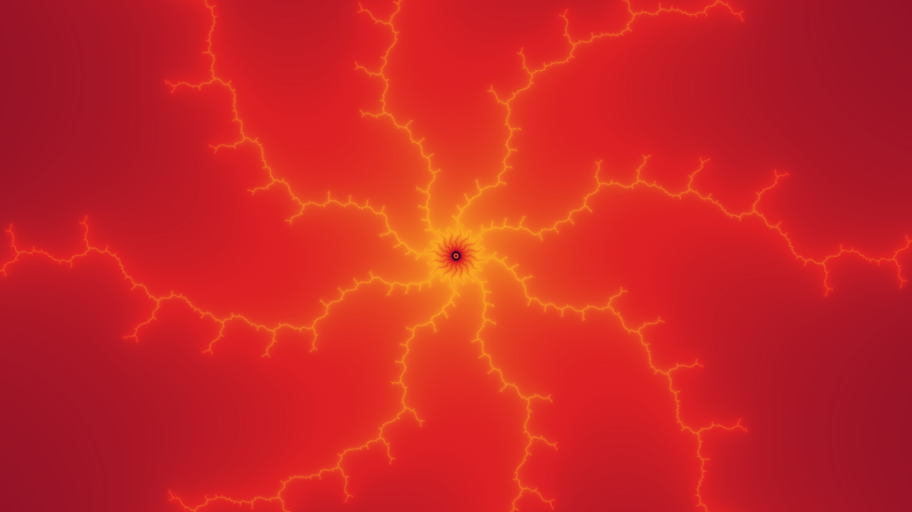

# Computing Still Images

In this tutorial you will learn how to create the DeepDrill cover image with the DeepDrill tool chain. 

It is assumed that DeepDrill has been installed successfully on your machine. The structure we will create is buried deep in the Mandelbrot set. To compute the image, we need to tell DeepDrill the location of the object. This is done by passing a location file (`.loc`) as a command line parameter. A predefined location file for the cover image is stored in the locations directory under `spider.loc`. Before we proceed, let's have a look at the contents of this file:

```
[location]

real = -2.2677664067387922388691356244792255191880358267082812585024439971401610105397724372362029456154053824622609164675371629196502594528331340581293956764916452361e-01
imag = -1.117239683936324591688558276484236515382167529582119984326546585480315896250189264406156057191817849297272681286515999107473779581849650803960450730872327827101e+00
zoom = 6.36119E152
depth = 3500000
```
Four key-value pairs are defined. The first two determine the position of the center coordinate on the complex number plane. The third pair defines the magnification factor and the fourth pair specifies the maximum number of iterations. If an orbit has not broken out by the time this iteration is performed, the corresponding point is considered to be part of the Mandelbrot set.

Assuming the current directory is DeepDrill's main directory, we can launch DeepDrill by executing the following command on the command line:
```bash
./deepdrill -o spider.map ../locations/spider.loc
```
The following output is generated: 
````none
DeepDrill 1.0 - (C)opyright Dirk W. Hoffmann

Round 1: 518400 points

   Computing reference orbit: ................................. 0.01 sec
      Computing coefficients: ................................. 0.05 sec
       Checking probe points: ................................. 0.00 sec
      Computing delta orbits: ................................. 0.48 sec
             Saving map file: ................................. 0.01 sec

Total time: 0.57 sec
````
Note that we don't generate the image directly. Instead, we compute a so called map file which stores various information about the orbit of each pixel. Creating the map file is the first phase in a two-phase process. In the second phase, the map file is tranlated into an image. This phase is started by specifying a map file as input and an image file as output.
```bash
./deepdrill -o spider.png spider.map
```
The following output is generated: 
```none
DeepDrill 1.0 - (C)opyright Dirk W. Hoffmann

            Loading map file: ................................. 0.02 sec
                  Colorizing: ................................. 0.00 sec
           Saving image data: ................................. 0.05 sec

Total time: 0.08 sec
```
Besides png images, DeepDrill supports images of type bmp and jpg.

By default, DeepDrill generates a 960 x 540 pixel image with a predefined color palette and other predefined standard settings. For our example, the followign image is created:


All settings can be customized by specifying one or more profiles (`.prf` files). 
DeepDrill comes with a number of predefined profiles, such as the vulcano.prf profile, which changes the color scheme. Profiles are passed to DeepDrill with the `-p` option:
```bash
./deepdrill -v -o spider.png -p ../palettes/vulcano.prf ../locations/spider.loc
```
Now, the image is created in the following form: 



As can be seen in this example, it is possible to go directly from a location file to an image. In this case the map file is only built internally and not written to disk. Since rendering the map file is by far the most time-consuming part, saving map files to disk is the preferred method if a single map file is to be rendered multiple times, e.g. with different color palettes.	

You may also have spotted the additional `-v` option. If this option is specified, DeepDrill runs in verbose mode and prints details about the settings and the current computing run.

