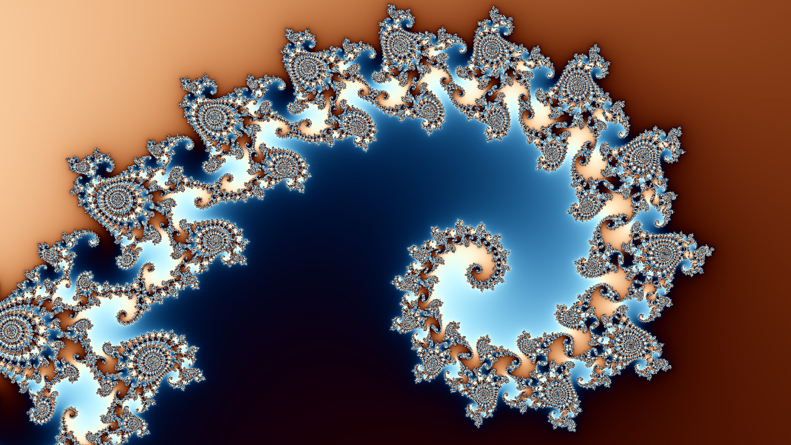
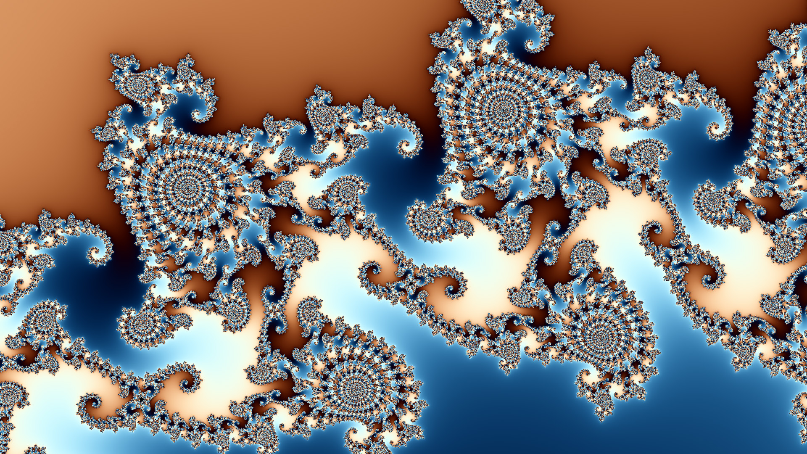
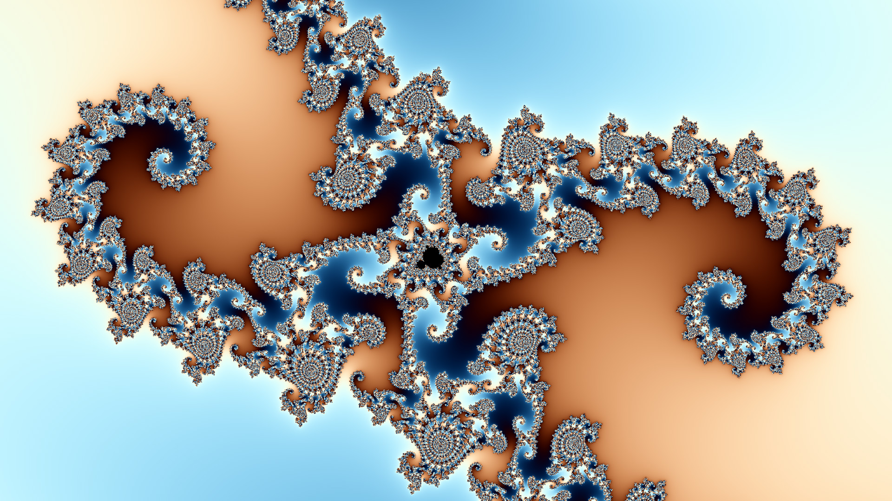

# Computing Still Images

In this tutorial, you will learn how to create still images using the DeepDrill toolchain. 

We start by computing a top view of the entire Mandelbrot set. To compute the image, we need to tell DeepDrill the location of the object. This is done by passing a so-called location file (`.loc`) as a command line parameter. A predefined location file for the title image is stored in the `tutorial` directory under `top.loc`. Before we continue, let's take a look at the contents of this file:
```INI
[location]
real = -0.7
imag = 0.0
zoom = 1.7
depth = 1000
```
Four key-value pairs are defined. The first two define the position of the center coordinate on the complex number plane. The third pair defines the magnification factor and the fourth pair defines the maximum number of iterations. If an orbit has not yet broken out at the time this iteration is performed, the corresponding point is considered part of the Mandelbrot set.

Assuming the current directory is the build directory, we can start DeepDrill by executing the following command at the command line:
```shell
./deepdrill -o image.map top.loc
```
The following output is generated: 
````none
DeepDrill 2.0 - (C)opyright Dirk W. Hoffmann

Round 1: 2073600 points

     Computing reference orbit: ................................. 0.00 sec
        Computing coefficients: ................................. 0.00 sec
         Checking probe points: ................................. 0.00 sec
        Computing delta orbits: ................................. 6.34 sec
               Saving map file: ................................. 0.08 sec

Total time: 6.43 sec
````
Note that we have not generated the image directly. Instead, we computed a so-called map file, which stores various information about the orbit of each pixel. The creation of the map file is the first phase of a two-step process. In the second phase, the map file is converted into an image. This is done by specifying a map file as input and an image file as output.
```shell
./deepdrill -o image.jpg image.map
```
The following output is generated: 
```none
DeepDrill 2.0 - (C)opyright Dirk W. Hoffmann

              Loading map file: ................................. 0.08 sec
           Computing color map: ................................. 0.05 sec
           Running GPU shaders: ................................. 0.01 sec
                  Saving image: ................................. 0.02 sec

Total time: 0.19 sec
```
Besides jpg images, DeepDrill also supports bmp and png type images.

By default, DeepDrill creates a 1920 x 1080 image with a predefined color palette and other default settings:


All settings can be customized by specifying one or more key-value pairs. The simplest way to define such a pair is to use the `-c` command line option. For example, the following invocation instructs DeepDrill to create the image in 4K resolution:
```shell
./deepdrill -o top.jpg -c image.width=3840 -c image.height=2160 top.loc 
```
This example also demonstrates the possibility of going directly from a location file to an image. In this case the map file is only created internally and not written to disk. Since rendering the map file is by far the most time-consuming part, saving map files to disk is the preferred method if a single map file is to be rendered multiple times, e.g. with different color palettes. 

Since the number of key-value pairs may become very large, DeepDrill allows the user to customize the settings via profiles. For example, the `profiles` folder contains a predefined profile named `4K.prf` with the following content:
```INI
[image]
width = 3840
height = 2160
```
Profiles can be specified with the `-p` option at the command line. This means that we can simplify the calculation of our 4K image by running DeepDrill as follows: 
```shell
./deepdrill -o top.jpg -p 4K.prf top.loc
```
The `-p` option can be specified multiple times to combine different profiles. Note that the old value of a key-value pair is overwritten if it is specified multiple times. All profiles are processed in the same order as they appear in the argument list.

In the next example, we'll dig a little deeper into the Mandelbrot set navigating to three different locations:
```shell
./deepdrill -o seahorse1.jpg seahorse1.loc
./deepdrill -o seahorse2.jpg seahorse2.loc
./deepdrill -o seahorse3.jpg seahorse3.loc
```
As a result, we get three well known images. All three structures are hidden in a part of the Mandelbrot set known as *seahorse valley*.





