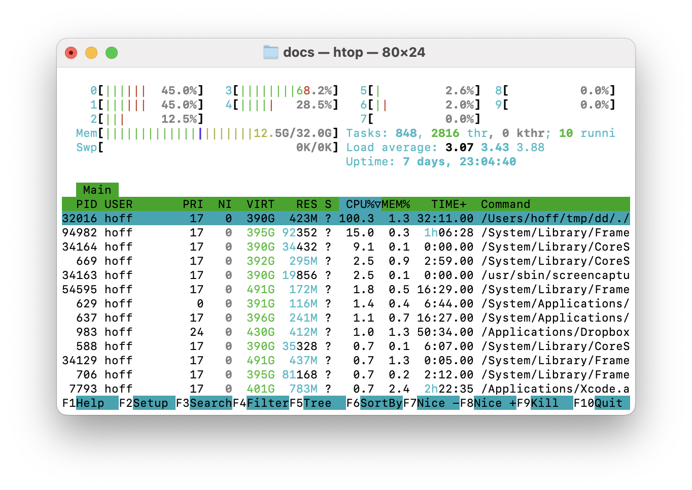

# Computing Zoom Videos

In this tutorial, you will learn how to create Mandelbrot zoom videos using the DeepDrill toolchain. In particular, you will learn how to compute the following video:

<iframe width="560" height="315" src="https://www.youtube.com/embed/Ayc5bE9nmTA" title="YouTube video player" frameborder="0" allow="accelerometer; autoplay; clipboard-write; encrypted-media; gyroscope; picture-in-picture; web-share" allowfullscreen></iframe>

Unlike calculating still images, creating a zoom video requires a much more sophisticated workflow. For example, multiple keyframes must be calculated and stitched together in the right way. To simplify the process, video creation has been divided into three phases. In the first phase, `deepmake` is used to create a Makefile and a larger number of input files. In the second phase, the Makefile is executed to compute all keyframe images via seperate invocations to `deepdrill`. In the last phase, `deepzoom` is executed to assemble the final video by calculating intermediate frames.

## Setting Up the Workflow

We start by creating an empty project directory:
```shell
mkdir project
```
To set up a workflow in this directory, we launch `deepmake` with the following options:
```shell
./deepmake mordor.ini -o project
```
The application first tells you how many files will be created and asks for your permission to proceed:
```
DeepMake 2.0 - (C)opyright Dirk W. Hoffmann

79 files will be created. Do you want to proceed [no]? 
```
After confirming with `yes` or `y`, `deepmake` generates all files:
```none
DeepMake 2.0 - (C)opyright Dirk W. Hoffmann

79 files will be created. Do you want to proceed [no]? yes

       Generating project file: ................................. 0.00 sec
  Generating 75 location files: ................................. 0.01 sec
            Generating profile: ................................. 0.00 sec
           Generating Makefile: ................................. 0.00 sec

Total time: 0.01 sec
```
Let's have a more detailed look at the configuration file. Besides providing the location and iteration parameters, the following key-value pairs are defined: 
```INI
[image]
depth = 1

[video]
keyframes = 180
inbetweens = 60
bitrate = 8000

[colors]
palette = vulcano.png
texture = elvish.jpg
```
The `depth` key in the `image` section advises DeepDrill to compute a spatial image. All video related parameters are specified in the `video` section. The first key specifies the number of keyframes to calculate, and the second key specifies how many frames to insert between two consecutive keyframes. Because the video will be recorded at 60 Hz, the specified value results in a delay of exactly one second between two keyframes. Because 180 keyframes are computed, the resulting video will play for 3 minutes. 

Let's take a closer look at the files DeepDrill created in the project directory:  
- `deepzoom.ini`
  This file contains several key-value pairs which will be picked up by `deepzoom` to assemble the final video. It plays no role in the creation of the keyframe images.

- `keyframe_0.ini` to 'keyframe_80.ini'
  These configuration files are used to calculate the keyframes. They are composed out of the configuration files that were passed in as command line arguments when the workflow was set up.

- `Makefile`
  This is a standard Makefile that automatically calculates all keyframe images. In the next section we will take a closer look at its contents.

## Computing all keyframes

For our tutorial project, DeepDrill has created the following Makefile:

```Make
# Generated by DeepDrill 2.0 on Tue Jun 13 18:19:24 2023
# 
# Copyright (C) Dirk W. Hoffmann. www.dirkwhoffmann.de
# Licensed under the GNU General Public License v3

DEEPDRILL  = /Users/hoff/tmp/dd/./deepdrill
DEEPZOOM   = /Users/hoff/tmp/dd/./deepzoom
MAPS       = $(patsubst %.loc,%.map,$(wildcard *_*.loc))
VIDEO      = spider.mov
MAPFLAGS   = -b -v

.PHONY: all maps clean

all: maps

maps: $(MAPS)

%.map: %.loc
  @$(DEEPDRILL) $(MAPFLAGS) -p spider.prf -o $*.map -o $*.jpg $*.loc > $*.log

$(VIDEO): $(IMAGES)
  @$(DEEPZOOM) $(MOVFLAGS) spider.prj -o $(VIDEO)

clean:
  rm *.mov *.map *.jpg *.log
```
The Makefile defines two major goals: One is to create the map files from the location files and the other one is to compose the final video. To create all map files, we change to the project directory and run the Make utility:
```shell
cd project
make -j4
```
The `-j` option instructs Make to run multiple jobs in parallel, four jobs in this case. Although this option is not mandatory, its use is strongly recommended as it significantly reduces the overall computation time.

Depending on the performance of your machine, it may take a while to calculate all images. DeepDrill informs about the current progress by outputting brief status information:
```none
[0%] 0/76: Drilling spider_0.map ...
[0%] 0/76: Drilling spider_11.map ...
[0%] 0/76: Drilling spider_10.map ...
[0%] 0/76: Drilling spider_1.map ...
[0%] 0/76: Created spider_10.map (3.47 sec)
[1%] 1/76: Created spider_11.map (3.49 sec)
[2%] 2/76: Drilling spider_12.map ...
[2%] 2/76: Drilling spider_13.map ...
[2%] 2/76: Created spider_12.map (3.23 sec)
[3%] 3/76: Created spider_13.map (3.29 sec)
...
```
Another way to obtain information about the current progress is to launch `htop`in a seperate terminal window. `htop` is available for all Unix-like operating systems and reports detailed information about all running processes:
```shell
htop 
```


After successful completion, the project directory contains a map file and an image file for each keyframe. 

## Assembling the Zoom Video

The final step is to combine all the keyframes into a zoom video by calling `make` with the `spider.mov` target as argument:
```shell
make spider.mov 
```
This target executes a separate tool called `deepzoom` which stiches together all previously computed keyframes. After completion, file `spider.mov` will be created, which contains the final video. 
